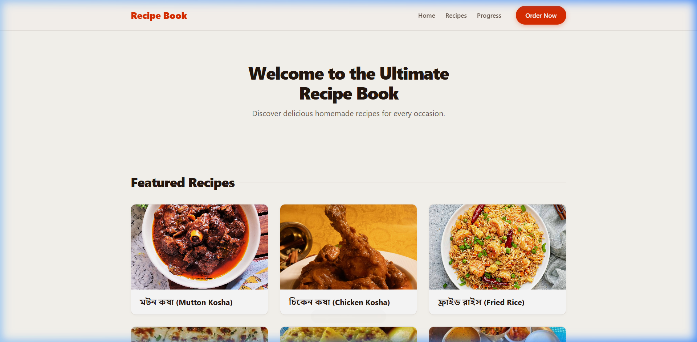

# 🍲 Multi-Page Recipe Book

> A performant, accessible, and beautifully architected static culinary web application built with modern HTML5 & CSS3. Featuring Cascade Layers (`@layer`), an OKLCH perceptual color palette, fluid clamp-based typography, and a zero-JavaScript responsive navigation system.

[](https://developer.mozilla.org/en-US/docs/Web/HTML)
[](https://developer.mozilla.org/en-US/docs/Web/CSS)
[](https://developer.mozilla.org/en-US/docs/Web/CSS/@layer)
[](https://developer.mozilla.org/en-US/docs/Web/CSS/color_value/oklch)
[](https://en.wikipedia.org/wiki/Vanilla_software)
[](https://opensource.org/licenses/MIT)

---

## 📌 Table of Contents

- [Overview](#-overview)
- [Project Preview](#-project-preview)
- [Key Features](#-key-features)
- [CSS Architecture & Design System](#-css-architecture--design-system)
- [Repository Structure](#-repository-structure)
- [Tech Stack](#-tech-stack)
- [Getting Started](#-getting-started)
- [Engineering Highlights](#-engineering-highlights)
- [Performance & Accessibility](#-performance--accessibility)
- [Browser Compatibility](#-browser-compatibility)
- [Roadmap](#-roadmap)
- [Author & Connect](#-author--connect)

---

## 📖 Overview

The **Multi-Page Recipe Book** is a multi-page web application showcasing traditional and contemporary Bengali and Indian recipes (such as *Mutton Kosha*, *Chicken Kosha*, *Butter Naan*, *Khichuri*, *Fried Rice*, and *Sabjivat*).

Rather than relying on heavy client-side frameworks or external CSS libraries, this project serves as a showcase of **state-of-the-art native web standards**. It leverages modern CSS Cascade Layers (`@layer`), fluid clamp-based typography, perceptual OKLCH color palettes, and CSS-only interactive state machines, providing instantaneous page loads with zero runtime overhead.

---

## 📸 Project Preview



*Desktop view showcasing the sticky frosted-glass header, hero banner, interactive recipe grid, and live progress indicators.*

---

## ✨ Key Features

### 1. Sticky Glassmorphism Header
- Pinned `position: sticky; top: 0` navigation bar with `backdrop-filter: blur(16px)` and translucent warm parchment elevation.
- Encapsulates brand identity, jump links to sections (`#featured-recipes`, `#cooking-progress`), and an active "Order Now" dial-in CTA button.
- The hero section scrolls up naturally beneath the navbar, keeping screen real estate uncluttered.

### 2. Multi-Page Recipe Showcase
- Dedicated individual detail pages for each recipe located under `/pages/`:
  - **মটন কষা (Mutton Kosha)** — Slow-cooked rich Bengali mutton delicacy.
  - **চিকেন কষা (Chicken Kosha)** — Authentic spiced caramelized chicken curry.
  - **ফ্রাইড রাইস (Fried Rice)** — Indo-Chinese wok-tossed aromatic rice.
  - **বাটার নান (Butter Naan)** — Soft, tandoor-style charred flatbread.
  - **খিচুরি (Khichuri)** — Traditional comfort rice and roasted lentil porridge.
  - **সবজি ভাত (Sabjivat)** — Healthy mixed vegetable herb rice platter.

### 3. Detailed Recipe Anatomy
- **Sticky Ingredients Sidebar**: Floats alongside preparation steps on widescreen monitors for continuous reference while scrolling through the method.
- **Structured Preparation Steps**: Step-by-step cooking cards with highlighted step numbers, timestamps, and actionable chef notes.
- **Pro Tip Callout Boxes**: Accent-bordered highlight cards delivering tips for authentic flavor profiles.

### 4. Interactive Cooking Progress Tracker
- Native HTML5 `<progress>` bars styled across both Blink/WebKit and Gecko engines.
- Color-coded status badges:
  - <kbd>Completed</kbd> — Emerald green highlight.
  - <kbd>In Progress</kbd> — Terracotta amber indicator.
  - <kbd>Not Started</kbd> — Subdued neutral slate.

### 5. Pure CSS Mobile Drawer Navigation
- Responsive hamburger menu driven entirely by the CSS `:checked` selector on a hidden checkbox toggle.
- Zero JavaScript required to slide out a full-height glass drawer on mobile and tablet viewports.
- Hamburger smoothly transforms into an "X" close button using CSS hardware-accelerated transforms.

---

## 🎨 CSS Architecture & Design System

The styling follows an organized, modular architecture structured around **CSS Cascade Layers (`@layer`)**. This completely eliminates specificity conflicts and selector weight wars without relying on `!important`.

```css
@layer reset, tokens, layout, components, pages;
```

### Layer Breakdown

| Layer | File | Description |
| :--- | :--- | :--- |
| `reset` | [`reset.css`](assets/css/reset.css) | Modern baseline reset, box-sizing normalization, media element fluid scaling, and typography reset. |
| `tokens` | [`tokens.css`](assets/css/tokens.css) | Design tokens: OKLCH color palettes, fluid clamp typography, elevation shadows, radii, and transition timings. |
| `layout` | [`layout.css`](assets/css/layout.css) | Structural layouts: fluid containers, sticky site-header, hero section, grid systems, mobile drawer, and footer. |
| `components` | [`components.css`](assets/css/components.css) | Reusable UI components: recipe cards, image aspect ratio containers, CTA buttons, badges, and progress table. |
| `pages` | [`recipe-detail.css`](assets/css/recipe-detail.css) | Detail page specifications: two-column recipe body, sticky ingredients aside, step cards, and tip callouts. |
| **Main** | [`style.css`](assets/css/style.css) | Single orchestrator that establishes layer order and imports all stylesheets in sequence. |

### Color Science: OKLCH Color Space
This project utilizes the `oklch()` color model for consistent perceived lightness and saturation across all screen types:
- **Terracotta Primary**: `oklch(0.58 0.22 38)`
- **Culinary Emerald**: `oklch(0.62 0.16 142)`
- **Warm Parchment Canvas**: `oklch(0.985 0.008 85)`
- **Elevated White Surface**: `oklch(1 0 0)`
- **Charcoal Typography**: `oklch(0.22 0.025 50)`

---

## 📂 Repository Structure

```text
Multi-Page-Recipe-Book/
├── assets/
│   ├── css/
│   │   ├── components.css       # Recipe cards, buttons, badges, progress bar
│   │   ├── layout.css           # Header, sticky navbar, hero, drawer, footer
│   │   ├── recipe-detail.css    # Recipe detail page layout & sidebar
│   │   ├── reset.css            # Standard modern CSS reset
│   │   ├── style.css            # Main stylesheet layer orchestrator
│   │   └── tokens.css           # OKLCH colors, fluid typography, radii, shadows
│   └── images/
│       ├── preview.png          # Project desktop preview screenshot
│       └── recipes/             # High-resolution recipe photography
│           ├── Butternaan.jpg
│           ├── Chicken.jpg
│           ├── Friedrice.jpg
│           ├── Khichuri.jpg
│           ├── Mutton.jpg
│           └── Sabjivat.jpg
├── pages/                       # Dedicated multi-page recipe detail views
│   ├── Butternaan.html
│   ├── Chicken.html
│   ├── Friedrice.html
│   ├── Khichuri.html
│   ├── Mutton.html
│   └── Sabjivat.html
├── index.html                   # Homepage catalog, hero, & cooking progress
└── README.md                    # Project documentation & engineering specs
```

---

## 💻 Tech Stack

| Technology | Role |
| :--- | :--- |
| **HTML5** | Semantic markup (`<header>`, `<nav>`, `<main>`, `<article>`, `<aside>`, `<table>`, `<progress>`) |
| **CSS3** | Modern styling: Cascade Layers (`@layer`), CSS Grid, Flexbox, `position: sticky`, `backdrop-filter` |
| **OKLCH** | Wide-gamut color standard ensuring perceptual uniformity across diverse displays |
| **Vanilla Architecture** | Zero runtime dependencies, no build pipeline required, pure static delivery |

---

## 🚀 Getting Started

### Quick Start (Local)

Because this is a pure static web project, it requires no package installations, compilers, or build steps.

1. **Clone the Repository:**
   ```bash
   git clone https://github.com/bhabakjishnu/Multi-Page-Recipe-Book.git
   cd Multi-Page-Recipe-Book
   ```

2. **Open the Application:**
   - Double-click `index.html` in your file explorer to open it directly in any modern web browser.
   - *Or* serve it using a lightweight local development server:
     ```bash
     # Using Node.js npx:
     npx serve .
     
     # Or using VS Code Live Server extension:
     # Right-click index.html -> "Open with Live Server"
     ```

### Deploying to GitHub Pages

1. Push your repository to GitHub.
2. In your repository settings, navigate to **Settings** → **Pages**.
3. Under **Build and deployment** → **Source**, select **Deploy from a branch**.
4. Choose the `main` (or default) branch and set the folder to `/ (root)`.
5. Click **Save**. Your site will be published at:
   ```
   https://bhabakjishnu.github.io/Multi-Page-Recipe-Book/
   ```

---

## 🧠 Engineering Highlights

- **Fluid Typography via `clamp()`**: Font sizes smoothly interpolate between screen widths without jagged media query jumps:
  ```css
  --text-3xl: clamp(2.15rem, 1.8rem + 1.8vw, 3rem);
  --text-xl: clamp(1.35rem, 1.25rem + 0.7vw, 1.65rem);
  ```
- **Zero-JS Mobile Menu**: State is controlled via an `<input type="checkbox" id="nav-toggle">` element:
  ```css
  .nav-toggle:checked ~ .nav-menu {
      transform: translateX(0);
  }
  ```
- **Hardware-Accelerated Micro-Animations**: Card hover elevations and image zoom effects utilize `transform: translateY()` and `scale()` to prevent browser layout reflows and ensure 60fps animations.
- **Native Image Lazy Loading**: All recipe photography specifies `loading="lazy"` to defer offscreen assets, accelerating initial First Contentful Paint (FCP).

---

## ♿ Performance & Accessibility

- **Semantic Landmark Hierarchy**: Proper use of `<h1>` through `<h3>`, `<header>`, `<nav>`, `<main>`, `<article>`, and `<aside>` provides navigational landmarks for assistive technologies.
- **Accessible Controls**: Mobile navigation elements include descriptive `aria-label` attributes. Progress indicators provide textual representation for screen readers via `aria-label`.
- **Contrast Ratios**: All text and background combinations adhere to **WCAG 2.1 AA** contrast requirements using high-contrast OKLCH values.
- **Reduced Motion Ready**: Transitions are cleanly decoupled for seamless integration with `@media (prefers-reduced-motion)`.

---

## 🌐 Browser Compatibility

Tested and fully compatible across all modern evergreen browsers:

| Browser | Supported Version | Notes |
| :--- | :---: | :--- |
| **Google Chrome** | 105+ | Full support for `@layer`, `oklch()`, and `backdrop-filter` |
| **Mozilla Firefox** | 113+ | Full support for `@layer`, `oklch()`, and custom `<progress>` |
| **Apple Safari** | 15.4+ | Full support with `-webkit-backdrop-filter` fallback |
| **Microsoft Edge** | 105+ | Chromium engine; 100% parity with Chrome |

---

## 🔮 Roadmap

- [ ] **Client-Side Search**: Instant recipe filtering by ingredient, cooking time, and dietary preference.
- [ ] **Dark Mode Theme**: Color theme switching driven by CSS custom properties and `color-scheme`.
- [ ] **Portion / Serving Calculator**: Dynamic ingredient quantity multiplier.
- [ ] **Printable Recipe Cards**: Dedicated `@media print` stylesheet for clean physical printing.

---

## 👤 Author & Connect

**Jishnu Bhabak**  
*Full Stack / Frontend Web Developer*

- **GitHub**: [@bhabakjishnu](https://github.com/bhabakjishnu)
- **Repository**: [Multi-Page-Recipe-Book](https://github.com/bhabakjishnu/Multi-Page-Recipe-Book)
- **Email**: [bhabakjishnu2004@gmail.com](mailto:bhabakjishnu2004@gmail.com)
- **Phone**: [+91 62941 31405](tel:+916294131405)
- **Location**: Sat Simulia, Haringhata, Nadia, WB 741257, India

---

## 📄 License

This project is open-source software licensed under the [MIT License](https://opensource.org/licenses/MIT). Feel free to explore, learn from, and adapt the code for your own projects!

---

<div align="center">
  <sub>Built with ❤️ and modern web standards. If you found this repository helpful, consider starring ⭐ the project!</sub>
</div>